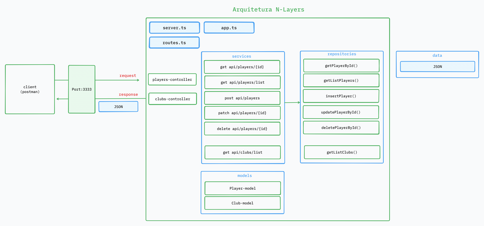

# 🏆 Champions API

API RESTful desenvolvida em **Node.js** com **Express.js**, estruturada com a arquitetura **N-Layers**, focada na separação de responsabilidades e boas práticas de desenvolvimento.

## 📌 Visão Geral



Esta aplicação expõe endpoints para gerenciamento de jogadores e clubes de futebol, permitindo operações CRUD completas, com persistência de dados simulada em arquivos JSON.

A arquitetura N-Layers aplicada facilita a manutenção, testes e escalabilidade do projeto, separando claramente as responsabilidades entre controllers, services, repositories e models.

---

## 🚀 Tecnologias Utilizadas

- [Node.js](https://nodejs.org/)
- [Express.js](https://expressjs.com/)
- [TypeScript](https://www.typescriptlang.org/)
- [Postman](https://www.postman.com/) (para testes de API)
- [JSON](https://www.json.org/json-en.html) (como base de dados mock)

---

## 📮 Endpoints Disponíveis

### Players
- `GET /api/players/list` – Lista todos os jogadores
- `GET /api/players/{id}` – Retorna um jogador pelo ID
- `POST /api/players` – Cadastra um novo jogador
- `PATCH /api/players/{id}` – Atualiza um jogador pelo ID
- `DELETE /api/players/{id}` – Remove um jogador pelo ID

### Clubs
- `GET /api/clubs/list` – Lista todos os clubes

---

## 🛠 Como Executar Localmente

1. Clone o repositório:
   ```bash
   git clone https://github.com/seu-usuario/champions-api.git
   cd champions-api
   
2. Instale as dependências:
     ```bash
    npm install
     
3. Inicie o servidor:
    ```bash
    npm run start:dev
    
4. Acesse via Postman ou navegador:
   ```bash
    http://localhost:3333/api/players

## 🧪 Testes
Você pode utilizar o Postman para testar os endpoints. As requisições retornam dados em formato JSON.

## 🧩 Arquitetura N-Layers

- Controllers: Recebem as requisições e repassam para os serviços.
- Services: Contêm a lógica de negócio.
- Repositories: Acessam e manipulam os dados.
- Models: Definem a estrutura dos dados.
- Data: Arquivo JSON simula uma base de dados.

## 📄 Licença
Este projeto está sob a licença MIT.

## ✨ Autor
Feito com 💚 por @debsmalheiro
Projeto desenvolvido para fins de aprendizado e portfólio.
